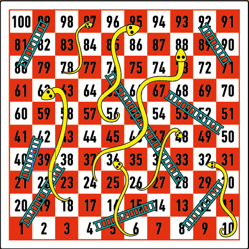

# Snakes-and-Ladders
Here, you can play Snakes and Ladders coded with python

This is based on the game board which you can find in a separate file called 'board'

# What I learned
Improved upon my ability to utilise dictionaries

# BOARD

